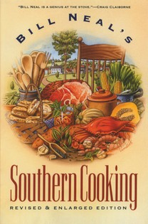
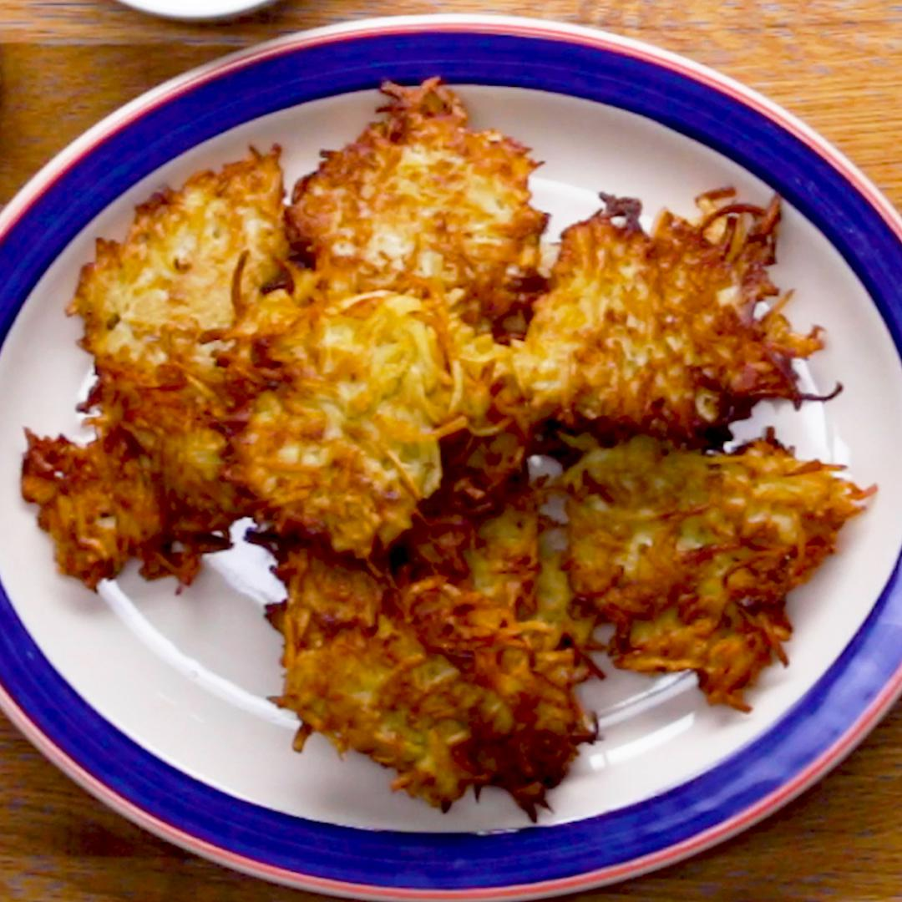
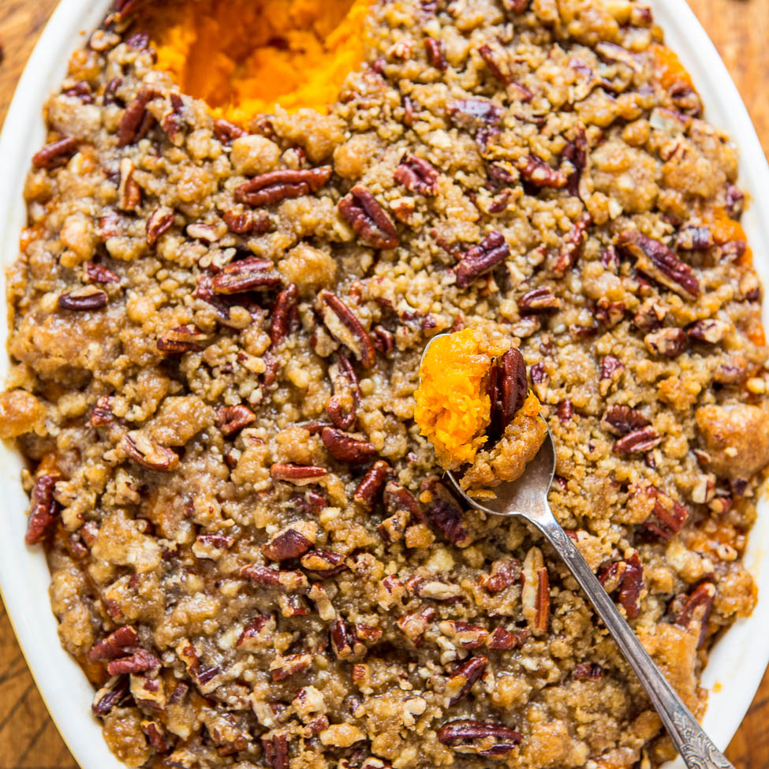
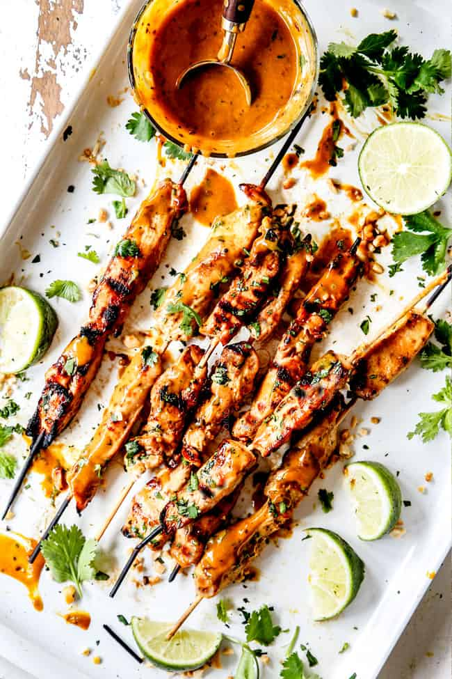
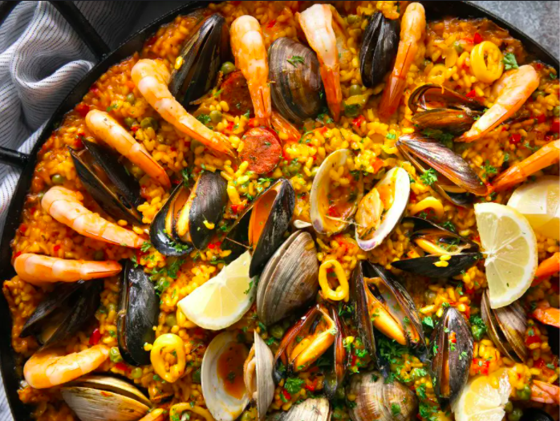

# Main Dishes {#maindish}

{width=19%} {width=29%} {width=29%}
{width=23%} {width=46%}

We've got some great recipes for you here:

- **Sara Helms Cahan** tells you how to make a [Yummy Butternut Squash & Pumpkin Soup], a treat for cold snowy nights in the heart of winter.
- **Matt Futia** shares his favorite dish to make every Chanukah with his family -- [Uncle Moe's Latkes].
- **Kristen Bishop** makes a mean [Mashed Sweet Potatoes with Pecan Streusel] and she shares the 20 year-old coveted recipe with you!
- **Por Tangwancharoen** tells you how to make his [Satay] -- back by popular demand from last year's potluck -- it is some yummy street food from Thailand.
- **Maia Austin** celebrates the Feast of the Seven Fishes with a delicious [Seafood Risotto]

## Yummy Butternut Squash & Pumpkin Soup

Sara Helms Cahan

### Pitch

We make this on cold snowy nights in the heart of winter - a savory and rich soup, a bit of pepper heat, elegant enough for dinner parties. Originally from Bill Neal’s Southern Cooking.

### Materials

- 1 ½ lbs fresh peeled butternut squash or pumpkin, cubed, or 1 lb canned pumpkin
- 3 Tbps butter
- ½ cup chopped scallions, white parts only
- ½ cup chopped celery
- ½ cup chopped carrots
- 1 chopped garlic clove
- 3 cups chicken or vegetable stock
- 1 cup canned Italian tomatoes, chopped, with juice
- ¼ tsp dried red pepper flakes
- ¼ tsp white pepper
- ⅛ tsp nutmeg
- 2 cups half-and-half
- Green tops of scallions, sliced thin for garnish

### Methods

1. Melt the butter in a saucepan and saute the scallions, celery and carrots gently.
2. Add the garlic, stir briefly, and add the stock, tomatoes, and squash/pumpkin.
3. Season with red pepper flakes, white pepper, and nutmeg.
4. Cook slowly for 1 hour.
5. Remove from heat, let cool slightly, and puree until texture is very smooth.
6. Before serving, add half-and-half, reheat gently.
7. Serve with green scallion sprinkled on top.

## Uncle Moe's Latkes

Matt Futia

{width=40%}

### Pitch

They are easy to make and can store well in the freezer if you have leftovers. 

### Story

These latkes (potato pancakes) are a favorite dish every Chanukah with my family. It's been a tradition to gather together and spend a day making batch after batch to share with family and friends. The recipe originally comes from my great Uncle Moe, who passed before I was born and who's name influenced my name -- the "M" in my first name came from his name.

### Materials

- 8 medium potatoes peeled  and placed in water
- 1 lg onion, peeled and finely grated
- 2 eggs
- 1 tsp. salt
- ½ tsp. pepper
- 1 tbsp. baking powder
- 1 cup matzo meal or bread crumbs         
- vegetable oil

### Methods

1. Grate potatoes with food processor.
2. Mix with grated onion, add eggs, salt, pepper and baking powder.
3. Pour into large bowl, add matzo meal and mix thoroughly.
4. Heat oil, and drop mixture into frying pan.
5. Turn when crisp and drain on brown paper bags.
6. Serve alone or with apple sauce.

## Mashed Sweet Potatoes with Pecan Streusel

Kristin Bishop

{width=40%}

### Pitch

I have been making this for friends and family for nearly 20 years and in all that time I don't think I have ever not had anyone ask me for the recipe. This one is a BIG winner.

### Materials

makes about 12 servings

- 10 meduim-sized tan-skinned sweet potatoes (~6 lbs), scrubbed  (I go by weight)
- 4 bananas, unpeeled
- 1 cup butter, room temperature
- ⅓ cup honey
- I added some cinnamon and ground cloves
- 1 ½ cups pecan pieces
- ¾ cup packed golden brown sugar
- ½ cup all purpose flour

### Methods

1. Preheat oven to 400ºF.  
2. Pierce sweet potatoes with fork.  
3. Place on rimmed baking sheet or in roasting pan and bake until almost soft, about 40 minutes (I find that this usually takes closer to 60, but it depends on the size of the sweet potatoes).
4. Add bananas to roasting pan alongside sweet potatoes and bake until banana skins brown, about 10 minutes.
5. Let sweet potatoes and bananas stand at room temperature until cool enough to handle, about 15 minutes (maintain oven temperature).
6. Cut sweet potatoes in half.
7. Scoop flesh from sweet potatoes into large bowl.
8. Peel bananas; add to bowl.
9. Add ½ cup butter and honey .
10. Beat with wooden spoon until blended and fluffy.
11. Season to taste with salt.
12. Transfer to 8-10 cup ovenproof baking dish.
13. Mix nuts, sugar and flour in bowl.
14. Add ½ cup butter, mix with fingertips until coarse crumbs form (Potatoes and streusel can be made one day ahead).
15. Cover separately; chill.
16. Before continuing, preheat oven to 400ºF.  
17. Sprinkle streusel over potatoes.  
18. Bake until top is golden brown and potatoes are hot, about 25 minutes.

## Satay

Sumaetee (Por) Tangwancharoen

{width=40%}

### Pitch

I made it for the department potluck last Christmas and people loved it. Some had asked me for a recipe especially for the sauce. This is a common street food in Thailand and across Southeast Asia. 

You can have the sauce with any other grilled meat and vegetables or even buttered toast.

### Materials

- chicken, pork, beef, tempeh, or firm tofu
- can of coconut milk
- 2 tbsps of Madras curry powder
- salt
- peanuts or peanut butter
- Panang curry paste
- Massaman curry paste
- fish sauce (or soy sauce)
- tamarind paste (optional)

- Note on ingredients: You can buy all of them from most Asian supermarkets

### Methods

<b>Satay grill</b>

1. Cut you choice of protein (chicken, pork, beef, tempeh, firm tofu) into chicken finger size
2.  Make the marinate -- half a can of coconut milk, 2 table spoons of Madras curry powder, salt to taste. This is good for about a pound of meat.
3. Marinate protein for at least 15 minutes.
4. It's best to cook it over a grill but oven bake is also fine. I bake at 350ºF for 30 minutes, flip the meat at 15 minutes.

<b>Dipping sauce</b>

1. Toast half a cup of peanuts in a pan until brown. Crush them into rough chunky paste. You can use peanut butter as a substitute
2, Fry 1 table spoon of Panang curry paste and 1 table spoon of Massaman curry paste in coconut cream over medium high heat until fragrant. If you buy coconut milk in a can, when you open the can, you can scoop the cream from the top. If you use coconut milk from a box, add a little bit of vegetable oil when you fry curry paste.
3. Add the rest of coconut milk and half a cup of water, bring it to simmer.
4. Add peanut paste. If you use peanut butter, just add only around 2 table spoons. Smooth peanut butter will thicken the sauce more than chunky paste. 
5. Season to taste with fish sauce (or soy sauce), sugar and tamarind paste (optional). The sauce should be salty with a touch of sweet (and sour)

## Seafood Risotto

Maia Austin

{width=40%}

### Pitch

My grandmother's family is from Sicily, where it's traditional to have "Feast of the Seven Fishes" on Christmas Eve. A lot of people will have this separated across many courses, but we usually have a small Christmas so we try to put as many into one dish as possible. 

This seafood risotto is delicious and includes 4 types of fish, plus optional Bottarga to add on top. If someone in your family is vegetarian, you can use vegetable stock and just keep the seafood separate.

### Materials

- 4 tablespoons olive oil 
- 2 cloves of garlic, finely chopped
- 12 medium shrimp, peeled and deveined
- ½ pound squid, cleaned and sliced into rings ¼-in thick
- 12 mussels
- 12 clams
- ¼ cup dry white wine
- Juice of ½ lemon
- 2 sprigs fresh thyme
- 2 sprigs fresh oregano

- 3 tablespoons olive oil
- 2 tablespoons butter
- 1 small onion
- 4 cloves of garlic, minced
- 10 Roma tomatoes, peeled, seeded, and chopped
- 2 cups Arborio rice
- ½ cup dry white wine
- Handful chopped Italian Parsley
- 10 fresh basil leaves, coarsely chopped
- 4 cups Fish Broth
- Optional - Bottarga (cured fish roe) for topping

### Methods

1. Clean the mussels and clams by rinsing, removing beards protruding from the shells, and soaking in heavily salted cold water (1/3 cup salt to 1 gallon water) for 30 minutes. If any shells are broken or not closed, discard.
2. Heat 4 tablespoons olive oil in a medium sized skillet. Add 2 cloves chopped garlic and cook over medium heat until fragrant. Add shrimp and sautée until lightly pink, then remove from pan and put to the side. Add the squid to the pan and cook for about 1-2 minutes, then place in bowl with the shrimp.
3. Place mussels and clams in the skillet with the white wine, lemon juice, and thyme and oregano. Cover and cook over high heat until shells open (probably around 5-10 minutes). Remove the mussels and clams from the pan, and keep the cooking juices to put into the risotto. Take the meat out of most of the shells, keeping a couple of each to put on top of the risotto.
4. Melt the butter with the remaining 3 tablespoons olive oil in a heavy-bottomed 2-quart saucepan over low heat. Add the onion and cook until translucent, then add garlic and cook until fragrant. Add tomatoes and cook over moderate heat until they begin to release their juices.
5. In a separate pan, heat the fish broth over high until very hot and then turn heat down to low.
6. Add the rice to the pot with the tomatoes and stir constantly until the rice has absorbed all of the juice. Add 1/2 cup white wine and continue stirring until it is fully absorbed. Add the parsley.
7. Add the hot broth to the rice a ladleful at a a time, stirring continuously and waiting until the liquid is absorbed before adding the next ladleful. Midway through the cooking time, about 15 minutes in, add in cooked seafood and salt and pepper to taste. Once all of the broth has been added, finish off by adding the reserved clam and mussel juices.
8. Top with fresh basil and finely grated bottarga and enjoy!

