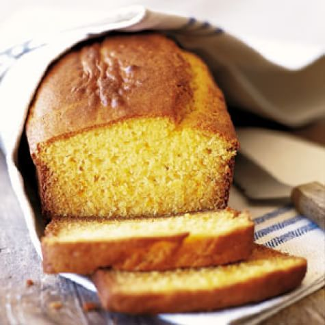

# Sides & Snacks

{width=45%} {width=45%}

- **Laura Caputo Newman** shares her recipe for [Chipotle Rosemary Roasted Nuts] -- a favorite holiday thank you gift for her kids' teachers.

- **Caroline Dumas** makes her gradmother's [Lemon Bread] -- great for breakfast or dessert.

## Chipotle Rosemary Roasted Nuts

Laura Caputo Newman

### Pitch

This is my go-to recipe for gifts for my kids' teachers, and the teachers look forward to them every year!

### Materials

- Vegetable oil 
- 3 cups whole roasted unsalted cashews (14 ounces) 
- 2 cups whole walnut halves (7 ounces) 
- 2 cups whole pecan halves (7 ounces) 
- ½ cup whole almonds (3 ounces) 
- ⅓ cup pure maple syrup 
- ¼ cup light brown sugar, lightly packed 
- 3 tablespoons freshly squeezed orange juice 
- 2 teaspoons ground chipotle powder 
- 4 tablespoons minced fresh rosemary leaves, divided 
- Kosher salt 

### Methods

1. Preheat the oven to 350ºF. 
2. Brush a sheet pan generously with vegetable oil. 
3. Combine  the cashews, walnuts, pecans, almonds, 2 tablespoons of vegetable oil, the maple syrup, brown sugar, orange juice, and chipotle powder on the sheet pan. 
4. Toss to coat the nuts evenly. 
5. Add 2 tablespoons of the rosemary and 2 teaspoons  of salt and toss again. 
6. Spread the nuts in one layer. 
7. Roast the nuts for 25 minutes, stirring twice with a large metal spatula, until the nuts are glazed and golden brown. 
8. Remove from the oven and  sprinkle with 2 more teaspoons of salt and the remaining 2  tablespoons of rosemary. 
9. Toss well and set aside at room temperature, stirring  occasionally to prevent sticking as they cool. 
10. Taste for  seasoning. 
11. Serve warm or cool completely and store in airtight containers at room temperature.

## Lemon Bread

Caroline Dumas

{width=45%}

### Pitch

This bread is amazing for breakfast or dessert. Wrap it with a red ribbon to make it a sweet gift. 

This is my favorite thing that my grandmother makes for every family gathering!

### Materials

- ⅔ cup vegetable oil 
- 2 ⅔ cups white sugar 
- 4 eggs
- 3 cups flour
- 2 tsp baking powder 
- 2 tsp salt 
- 1 cup milk 
- the rind and voice of 2 lemons 

### Methods

1. Preheat oven to 350ºF.
2. Cream oil and 2 cups of sugar together until fluffy.
3. Add eggs one at a time, scraping the bowl between each egg.
4. In a separate bowl combine flour, baking powder and salt.
5. Add dry ingredients to creamed mixture alternating with milk. Then add the lemon rind. 
6. Pour batter into a greased bread pan. Bake for 50 min.
7. Let cool in the pan. Run a knife around the edge of the pan and poke some holes in the top of the bread. 
8. In a bowl combine 2/3 cup sugar and lemon juice. Mix until sugar dissolves. 
9. Spoon liquid over the top of the load and allow it to set for 10 min before removing bread from the pan. 

