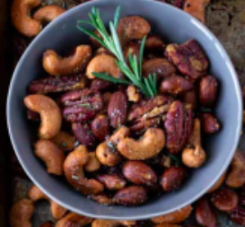

# Sides & Snacks

{width=45%} {width=45%}
{width=45%} {width=45%}

- **Laura Caputo Newman** shares her recipe for [Chipotle Rosemary Roasted Nuts] -- a favorite holiday thank you gift for her kids' teachers.
- **Caroline Dumas** makes her gradmother's [Lemon Bread] -- great for breakfast or dessert.
- **Emily Mikucki** shares a staple from her grandmothers' house, [Twice-Baked Potatoes], one of her  all-time top 5 favorite dishes. 
- **Ying-Wai Lam** pitch for why you should try his [Potstickers & Dumplings] is simple enough: "They taste good to me." So try 'em out yourself!

## Chipotle Rosemary Roasted Nuts

Laura Caputo Newman

### Pitch

This is my go-to recipe for gifts for my kids' teachers, and the teachers look forward to them every year!

### Materials

- Vegetable oil 
- 3 cups whole roasted unsalted cashews (14 ounces) 
- 2 cups whole walnut halves (7 ounces) 
- 2 cups whole pecan halves (7 ounces) 
- ½ cup whole almonds (3 ounces) 
- ⅓ cup pure maple syrup 
- ¼ cup light brown sugar, lightly packed 
- 3 tablespoons freshly squeezed orange juice 
- 2 teaspoons ground chipotle powder 
- 4 tablespoons minced fresh rosemary leaves, divided 
- Kosher salt 

### Methods

1. Preheat the oven to 350ºF. 
2. Brush a sheet pan generously with vegetable oil. 
3. Combine  the cashews, walnuts, pecans, almonds, 2 tablespoons of vegetable oil, the maple syrup, brown sugar, orange juice, and chipotle powder on the sheet pan. 
4. Toss to coat the nuts evenly. 
5. Add 2 tablespoons of the rosemary and 2 teaspoons  of salt and toss again. 
6. Spread the nuts in one layer. 
7. Roast the nuts for 25 minutes, stirring twice with a large metal spatula, until the nuts are glazed and golden brown. 
8. Remove from the oven and  sprinkle with 2 more teaspoons of salt and the remaining 2  tablespoons of rosemary. 
9. Toss well and set aside at room temperature, stirring  occasionally to prevent sticking as they cool. 
10. Taste for  seasoning. 
11. Serve warm or cool completely and store in airtight containers at room temperature.

## Lemon Bread

Caroline Dumas

{width=45%}

### Pitch

This bread is amazing for breakfast or dessert. Wrap it with a red ribbon to make it a sweet gift. 

This is my favorite thing that my grandmother makes for every family gathering!

### Materials

- ⅔ cup vegetable oil 
- 2 ⅔ cups white sugar 
- 4 eggs
- 3 cups flour
- 2 tsp baking powder 
- 2 tsp salt 
- 1 cup milk 
- the rind and voice of 2 lemons 

### Methods

1. Preheat oven to 350ºF.
2. Cream oil and 2 cups of sugar together until fluffy.
3. Add eggs one at a time, scraping the bowl between each egg.
4. In a separate bowl combine flour, baking powder and salt.
5. Add dry ingredients to creamed mixture alternating with milk. Then add the lemon rind. 
6. Pour batter into a greased bread pan. Bake for 50 min.
7. Let cool in the pan. Run a knife around the edge of the pan and poke some holes in the top of the bread. 
8. In a bowl combine 2/3 cup sugar and lemon juice. Mix until sugar dissolves. 
9. Spoon liquid over the top of the load and allow it to set for 10 min before removing bread from the pan. 

## Twice-Baked Potatoes

Emily Mikucki

{width=45%}

### Pitch

Can’t decide between baked potatoes and mashed potatoes? Why not have both?! This recipe is in my top 5 favorite foods EVER and was a staple at my grandma’s house growing up – holiday or not!

### Materials

- 4 medium-large russet potatoes (try to get equal sizes so they have equal cook times!)
- 2 - 3 Tbs butter (plus a little bit extra)
- ¼ – ½ cup milk or ½ and ½ 
- 8oz shredded cheddar cheese (my go-to is Cabot seriously sharp)
- salt 
- black pepper

- Hand mixer or stand mixer 
- Oven-safe dish

### Methods

1. Preheat oven to 400°F
2. Wash potatoes. Poke each potato with a fork a few times in different directions. Rub each potato with a little bit of the extra butter (this will make potato skins crispy!)
3. Cook potatoes directly on oven rack at 400°F for approximately 50-60min depending on size. *I learned from a podcast that the perfectly cooked potato has an internal temperature of 210°F, so if you have a cooking/meat thermometer, you can use that! 
4. *Important to do this next step while potatoes are still warm. So, I suggest using oven mitts to handle the hot potatoes*. Once potatoes are fully cooked, slice a long oval off the top of each potato so it looks like a little lid. Use a spoon to remove all the fluffy potato goodness, being careful not to rip the potato skins. Transfer potatoes insides to a mixing bowl or stand mixer. KEEP the potato skins and lids. 
5. Add butter, milk or ½ and ½, and cheese to the potatoes and mix until a mashed potato-like consistency. (These are just estimate amounts so add or subtract to your liking!)
6. Add salt and pepper to taste. 
7. Transfer potato mixture back to the skins giving generous amounts to each potato. Totally ok if overflowing a bit (actually might even be better…) and top back with the lid.
8. Put filled potatoes in an oven-safe dish and cook a second time for 20-25 minutes (or until the potato mixture starts to brown around the edges). 
9. Serve warm and enjoy! My grandpa always said the skins have the most nutrients, so we would always eat the whole thing! Who doesn’t love a crispy potato skin with a little bit of butter.

## Potstickers & Dumplings

Wai

{width=45%}

### Pitch

They taste good to me!

### Materials

<b>Pork potstickers</b>

- Minced pork (33%)
- Shiitake mushroom (33%)
- Green onions (5%)
- Oyster flavored sauce (4%)
- Less sodium soy sauce (2%)
- Ginger (1%)
- Basil  (1%)
- Sesame oil (0.4%)
- White wine (0.3%)
- Sesame seeds wine (0.3%)
- Dumpling wrapper (mainly wheat, flour, cornstarch) (20%)

<b>Vegetarian dumplings</b>

- Ka-Me Vermicelli (30%)
- Shiitake mushroom (30%)
- Carrot (10%)
- Green onions (5%)
- Low sodium soy sauce (2%)
- Basil (1%)
- Ginger (0.5%)
- Mirin (0.5%)
- Sesame oil (0.5%)
- Sesame seeds (0.5%)
- Dumpling wrapper (mainly wheat, flour, cornstarch) (20%)

<b>Dipping Sauce</b>

- Low sodium soy sauce (49%)
- Rice vinegar(49%)
- Sesame oil (2%)

Feel free to ask me for more details (MLS 337)!

