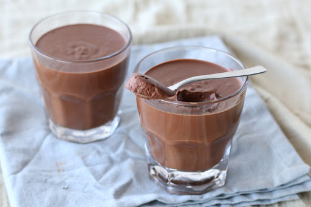
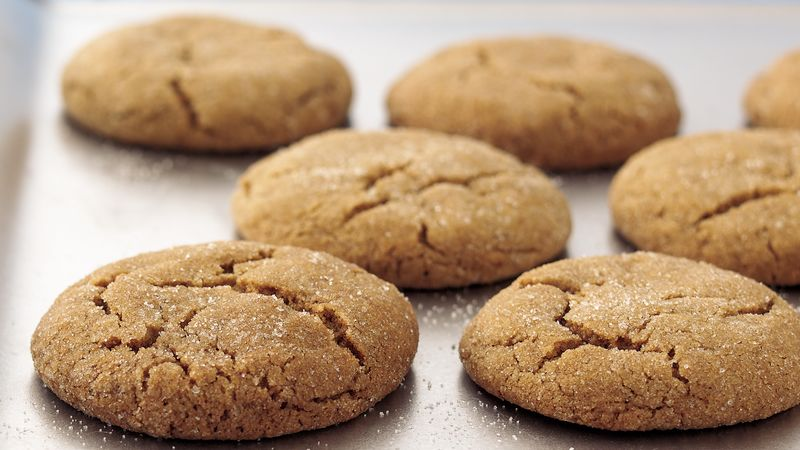
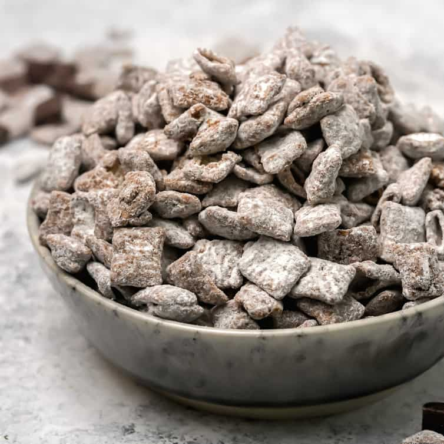
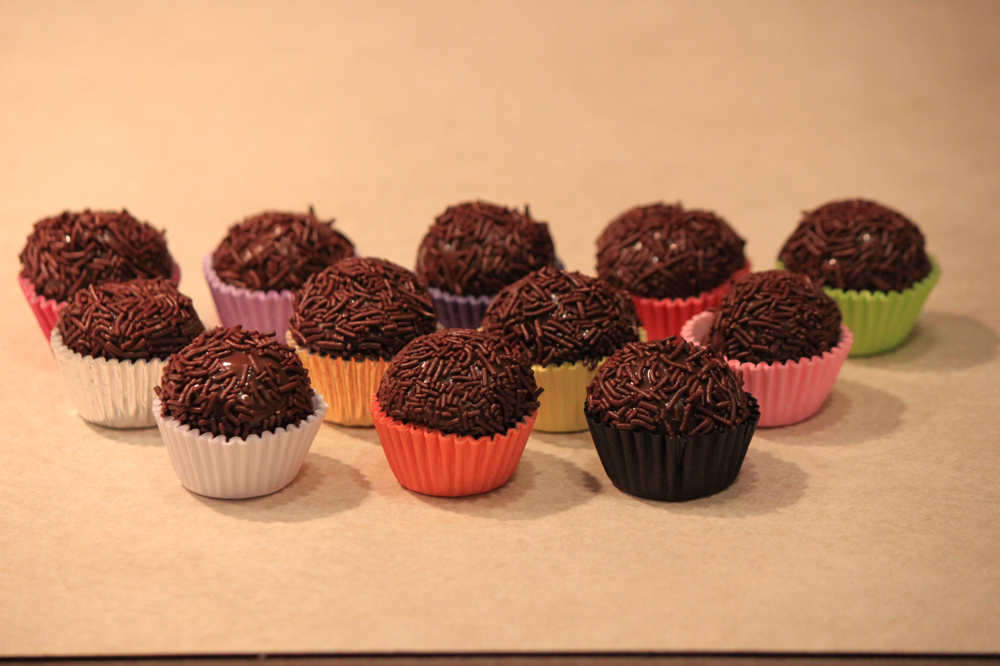

# Desserts {#desserts}

{width=30%} {width=30%} {width=36%} 
{width=48%} {width=48%}

We've got some delecious treats for you here:

- **Hannah Boyd** tells you how she makes [Muddy Buddies] -- a special treat full of crunchy, chocolatey, peanut buttery goodness.
- **Rachel Plouffe** shares a Brazilian recipe for [Brigadeiros -- Brazilian Truffles], a classic dessert at kid's birthdays and a treat she has been making with her daughter to share with the neighbors in these isolating times.
- **Leigh Sweet** has a pretty _sweet_ -- get it? -- recipe for a [Ginger Crinkle Cookie] that you don't want to miss.
- **Thomas O'Leary** shares a "recipe" for the _guilt-free_ treat of [Chocolate Mousse], that is way easier than pie to make!
- **Lauren Ash** celebrates the Feast of the Seven Fishes with [Nanny's Amaretti Cookies], which are Italian, gluten free, sweet and delicate almond cookies made by her grandmother.

## Muddy Buddies

Hannah Boyd

{width=45%}

### Pitch

If you love crunchy, chocolatey, peanut buttery goodness you will love this recipe! A great gift if you put it in glass jars and you can add some M&M's for color -- and flavor! 

### Materials

- 9 cups Rice Chex™, Corn Chex™ or Chocolate Chex™ cereal (or combination)
- 1 cup semisweet chocolate chips
- ½ cup peanut butter
- ¼ cup butter or margarine
- 1 teaspoon vanilla
- 1 ½ cups powdered sugar

### Methods

1. Into large bowl, measure cereal; set aside.
2. In 1-quart microwavable bowl, microwave chocolate chips, peanut butter and butter uncovered on High 1 minute; stir. Microwave about 30 seconds longer or until mixture can be stirred smooth. Stir in vanilla.
3. Pour mixture over cereal, stirring until evenly coated. Pour into 2-gallon resealable food-storage plastic bag or toss in a large mixing bowl.
4. Add powdered sugar. Seal bag; shake until well coated. Spread on waxed paper to cool. Store in airtight container.

## Brigadeiros -- Brazilian Truffles

Rachel Plouffe

### Pitch

This is classic Brazilian recipe that you see in every kid's birthday party. This year with all the craziness that is happening, my daughter and I have been baking something every week and delivering to the neighbors as a way to stay connected and hoping it will bring a little sweetness to their lives. This recipe has been their favorite so far. It is easy to make and kids can help with the sprinkles. There is also tons of variations you can find online.

### Materials

makes about 20 servings

- 1 tablespoon butter
- 1 can sweetened condensed milk
- ¼ cup cocoa powder
- 1 ½ cups chocolate sprinkle, as needed

### Methods

1. In pot over low heat add sweetened condensed milk, butter and sifted cocoa powder (sifting helps prevent lumps of cocoa powder).
2. Stir continuously (very important as mixture starts getting thicker) until you can tilt the pot and the mixture does not stick to it (or when you can see the bottom of the pot for about 3 seconds after dragging a spatula through).
3. Pour mixture onto a greased plate and let it cool.
4. Divide the mixture into 4 and using butter to grease your hands, shape the mixture into balls (each quarter of the mixture should make about 5 balls).
5. Roll the balls in chocolate sprinkles.
6. Enjoy!

## Ginger Crinkle Cookie

Leigh Sweet

{width=45%}

### Pitch

This is one of my favorite Christmas cookies. 

### Materials

- 2 eggs
- 4 cups sifted flour	                      
- 2 tsp cinnamon                                 
- 2 cup sugar	                   
- 4 tsp baking soda	                      
- 2 tsp ginger
- 1 ⅓ cup vegtable oil	   
- ½ tsp salt	
- ½ cup molasses

### Methods

1.	Mix together eggs, oil, molasses and sugar.
2.	Sift the dry ingredients together.
3.	Add the dry sifted mix to the wet mix. Stir together until combined. 
4.	Roll a teaspoon into a small ball and coat with sugar.
5.	Place on ungreased cookie sheet about 3 inches apart.
6.	Cookies will flatten and crinkle as they cook.
7.	Bake for 10 – 12 mins at 350ºF.
8.	Cool on a cookie rack.

## Chocolate Mousse

Thomas O'Leary

### Pitch

Do you like eating dessert -- but you are too nervous to bake things because you think you'll screw up the preparation, or the ingredients, or the baking time? Well, let me introduce you to my favorite dessert (and soon to be yours) chocolate mousse - _made straight from the box_! So light. So fluffy. So chocolatey. So delecious. 

Guilt-free dessert -- it's mostly air!

### Story

On my twelfth birthday, when I had learned all there is to learn, a delecious cake aflame infront of me, I said my mom -- respectfully, I hope -- "What's _the big deal_ with cake? It's clearly not the best dessert. Brownies are better. Ice cream is better. Chocolate Mousse is better. People eat cake on birthdays because that is _what you do_, not because it is the best dessert. What's up with that?"

My mom has never let me forget that I said that -- but she has been sure to make chocolate mousse for me every major holiday since. 

### Materials

 - Box of [Chocolate Mousse Mix](https://www.amazon.com/OETKER-Mousse-Chocolate-Milk-Ounces/dp/B00F4J7ZCI/ref=asc_df_B00F4J7ZCI/?tag=hyprod-20&linkCode=df0&hvadid=459693950627&hvpos=&hvnetw=g&hvrand=11603616910127190051&hvpone=&hvptwo=&hvqmt=&hvdev=c&hvdvcmdl=&hvlocint=&hvlocphy=9003006&hvtargid=pla-997270846247&psc=1)
    - Likely found in your local grocery store's pudding isle
 - Milk
 - Bowl
 - Electric mixer

### Methods

1. Add contents of the box and one cup of milk to a bowl.
2. Beat with the electric mixer on low until thickened.
3. Whip at the highest spead for 3 to 5 minutes.
4. Spoon into serving dish.
5. Chill in the refrigerator for at least an hour.
6. Eat!

## Nanny's Amaretti Cookies

Lauren Ash

{width=45%}

### Pitch

This is the recipe my grandma (Nanny) uses every year to make amaretti cookies. Every Christmas Eve, we normally travel to Nanny's house to celebrate the Feast of the Seven Fishes, which is an Italian-American tradition. Amaretti are the family's favorites and are Italian, gluten free, sweet and delicate almond cookies. This year, I asked for the recipe and will attempt them myself since we are unable to travel. I've attached a picture of my brother, myself, and Nanny after we helped make her amaretti cookies in 2018.

### Materials

makes about 5 dozen cookies

- 8 oz almond paste 
- 4 large egg whites
- 1 cup super-fine granulated sugar 
- pinch of salt
- 2 tsp almond extract 
- ¼ cup confectioners' sugar

### Methods

1. Preheat oven to 300ºF and line baking sheets with parchment paper.
2. Open the can of almond paste by opening both ends and pushing the paste through to the other side or buy almond paste in a bakery (it’s much softer and easier to use).
3. Break the almond paste into small pieces and place in the bowl of an electric mixer along with the sugar. Mix on low speed until the mixture is very fine.
4. Add 1 egg white and continue beating until smooth; fold in flavoring.
5. In a separate bowl, beat remaining egg whites until foamy; add salt and continue beating until stiff but not dry. (You know the whites are beaten thoroughly when you turn the bowl upside downand the whites adhere to the sides of the bowl and do not fall out).
6. Fold the beaten egg whites into the almond paste mixture and then beat for about 3 minutes or until very light.
7. Drop the batter by the half teaspoonful, leaving about 1 ½ inches between cookies.
8. When all cookies are set to bake, place confectioners' sugar into a fine sieve or flour sifter and gently shake it over the cookies so each cookie is lightly covered.
9. Let rest for 1 ½ hours.
10. Bake cookies in the preheated oven for 20 minutes or until golden-brown.
11. Remove from oven and allow to cool on the cookie sheets.
12. Gently remove cookies from parchment; if cookies stick to parchment, turn the paper over, take a damp paper towel and gently wipe the bottom of the parchment paper to loosen the cookie.
13. Store, tightly covered, in separated layers for up to two weeks, or freeze (To freeze, place cooled cookies on cookie sheet in a single layer in freezer until hard. Then remove to a zip-lock plastic bag, layer upon layer, without the cookies sticking to one another).
